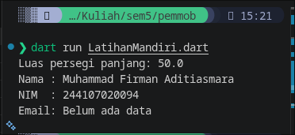
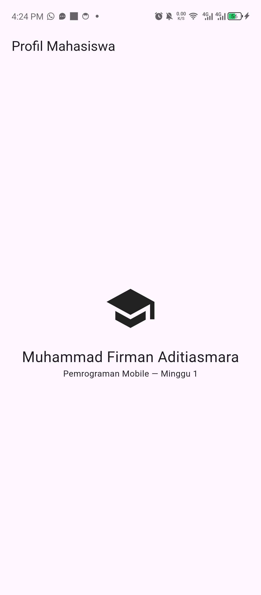
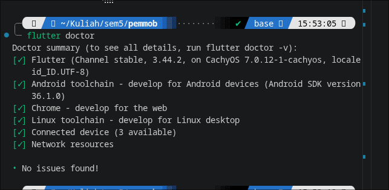
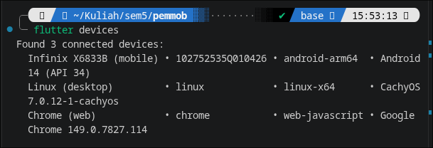
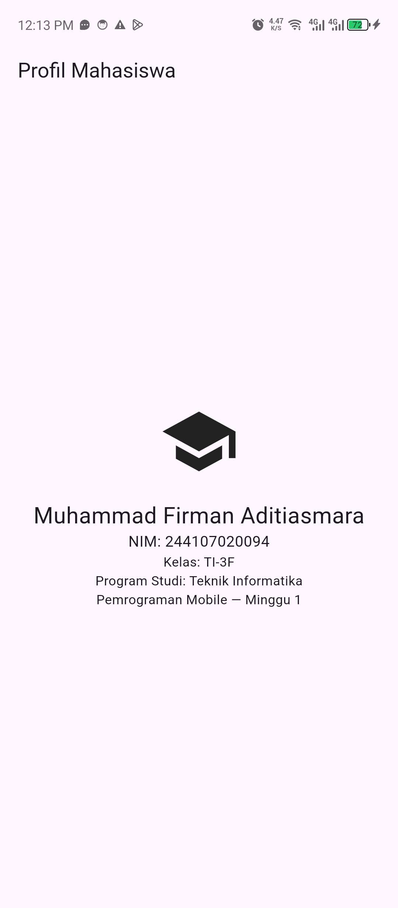

# 01 Week 1 Mobile Development Ecosystem & Flutter Refresh

Dokumentasi hasil pengerjaan Praktikum Pemrograman Mobile Minggu ke-1.
Dokumentasi ini telah berisi: Screenshot,penjelasan, dan jawaban dan pertanyaan dari Praktikum.

## Latihan Mandiri

1. Buat fungsi `hitungLuasPersegiPanjang(double panjang, double lebar)` yang mengembalikan luas.
2. Buat kelas `Profil` dengan properti `nama`, `nim`, dan `email` (boleh null/empty).
3. Panggil keduanya dari `main()` dan tangani kondisi email kosong dengan aman.

## Praktikum

Hasil praktikum ditampilkan di bawah ini:

## Checklist Verifikasi

- [x] `flutter doctor` tidak memiliki masalah yang menghambat target Android.  
	
- [x] `flutter devices` mendeteksi emulator/perangkat fisik.  
	
- [x] Aplikasi berjalan dan UI default telah diganti dengan profil sederhana.  
	
- [x] Dapat menjelaskan perbedaan hot reload dan hot restart.

Penjelasan singkat:

	- Hot reload: Memuat ulang hanya perubahan pada kode ke aplikasi yang sedang berjalan tanpa mengulang aplikasi dari awal. 
	- Hot restart: Memulai ulang aplikasi sepenuhnya, dan memuat ulang seluruh kode. Efektif difunakan apabila perubahan memerlukan inisialisasi ulang.

- [x] Repository remote berisi source code, README, screenshot, dan riwayat commit.
---
### Mini Assignment
Buat aplikasi Profil Mahasiswa berdasarkan praktikum. Tambahkan NIM dan satu informasi tambahan menggunakan widget dasar. 

--- 

### Kendala Setup
Kendala terjadi pada saat melakukan FLutter Doctor dan chrome terdapat error, kemudian solusi nya adalah dengan melakukan aktivasi chrome executable

## Refleksi

1. Kapan native lebih tepat dipilih daripada cross-platform?

	Jawab: Native lebih tepat Native lebih tepat dipilih ketika aplikasi membutuhkan performa tinggi dan akses mendalam ke fitur perangkat dan membutuhkan Akses API. Sedangkan Cross-platform lebih cocok jika ingin mengembangkan aplikasi untuk beberapa platform sekaligus.
2. Bagaimana perubahan state berhubungan dengan widget tree dan UI deklaratif?
	
	Jawab: Pada UI deklaratif Ketika state berubah, Flutter akan melakukan rebuild pada bagian widget tree yang diubah sehingga tampilan akan diperbarui sesuai state terbaru.
3. Mengapa commit kecil dengan pesan jelas bermanfaat bagi pekerjaan tim dan portfolio?
	
	Jawab: Commit kecil dan pesan yang jelas membuat perubahan lebih mudah dipahami, dilacak, dan direview oleh anggota tim. Dengan commit yang jelas maka jika terjadi kesalahan dapat dilacak riwayat commit sehingga dapat dikembalikan. Untuk Portofolio riwayat commit yang rapi dapat menunjukkan bahwa seseorang memiliki kebiasaan yang terstruktur

