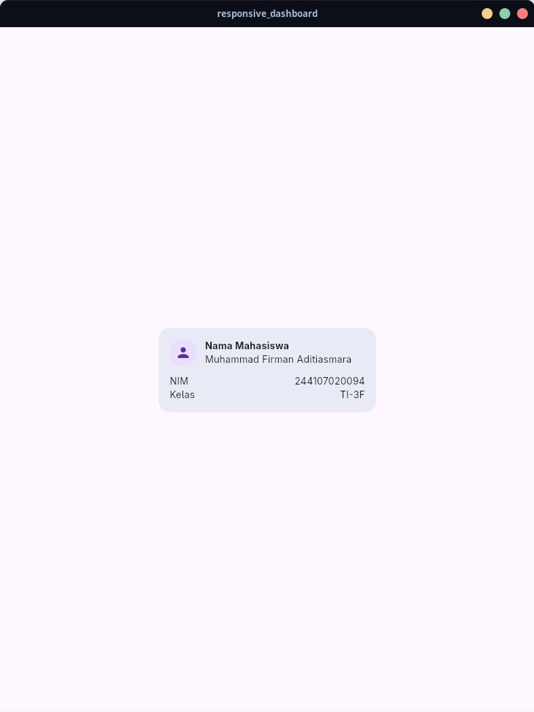
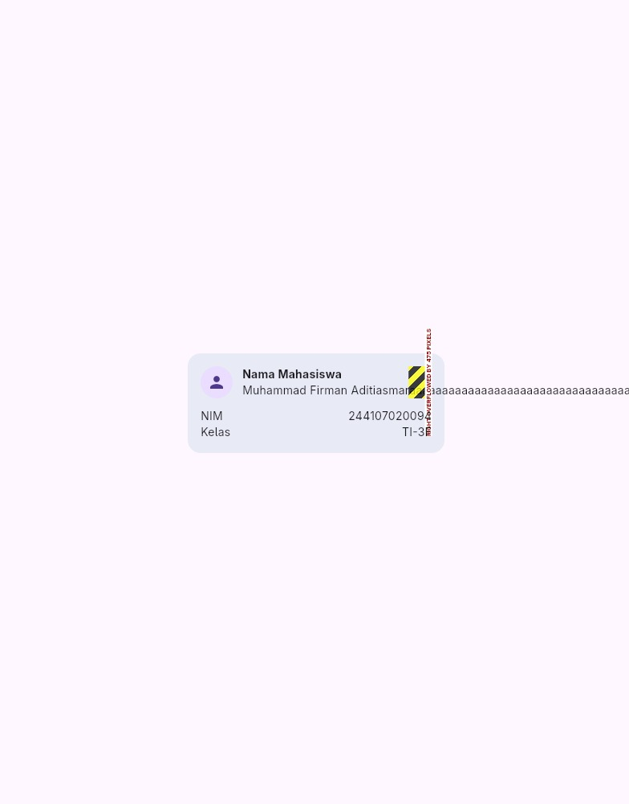
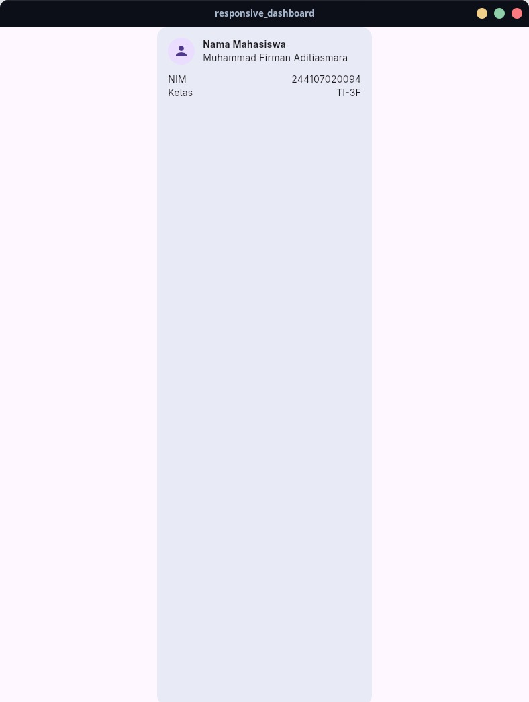
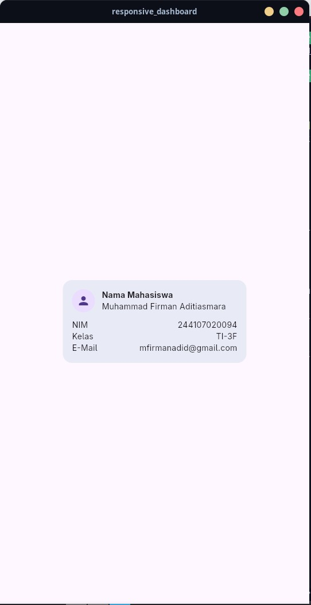
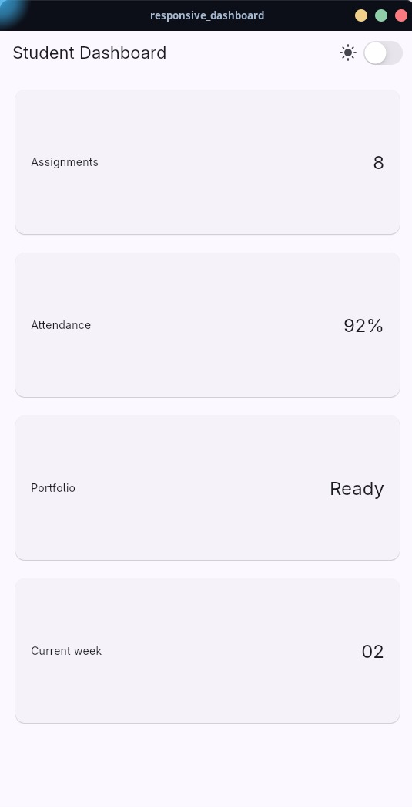
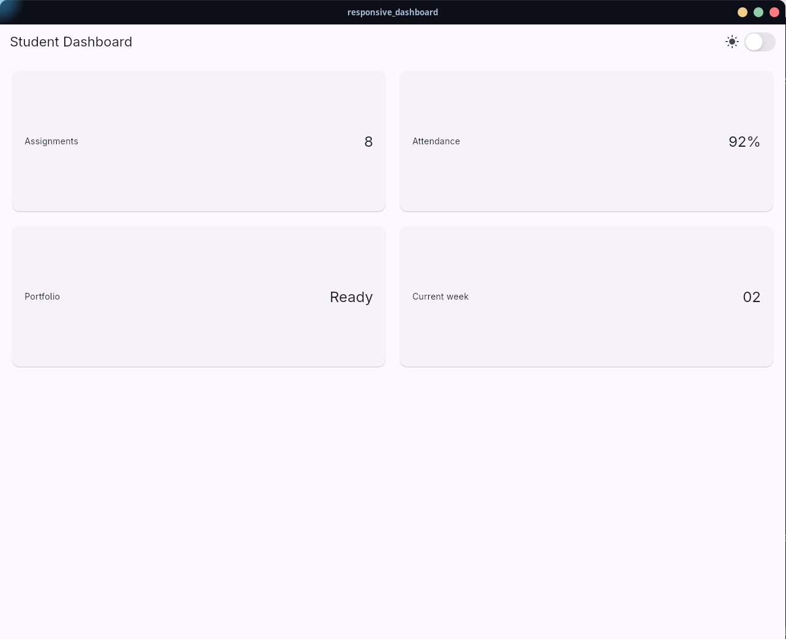
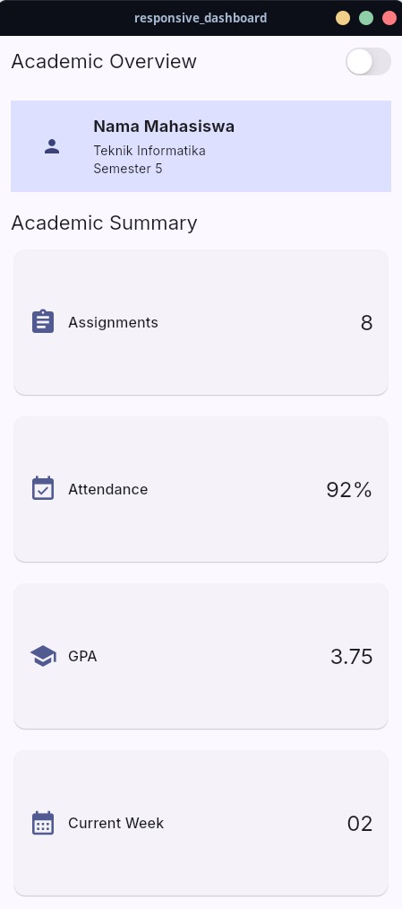
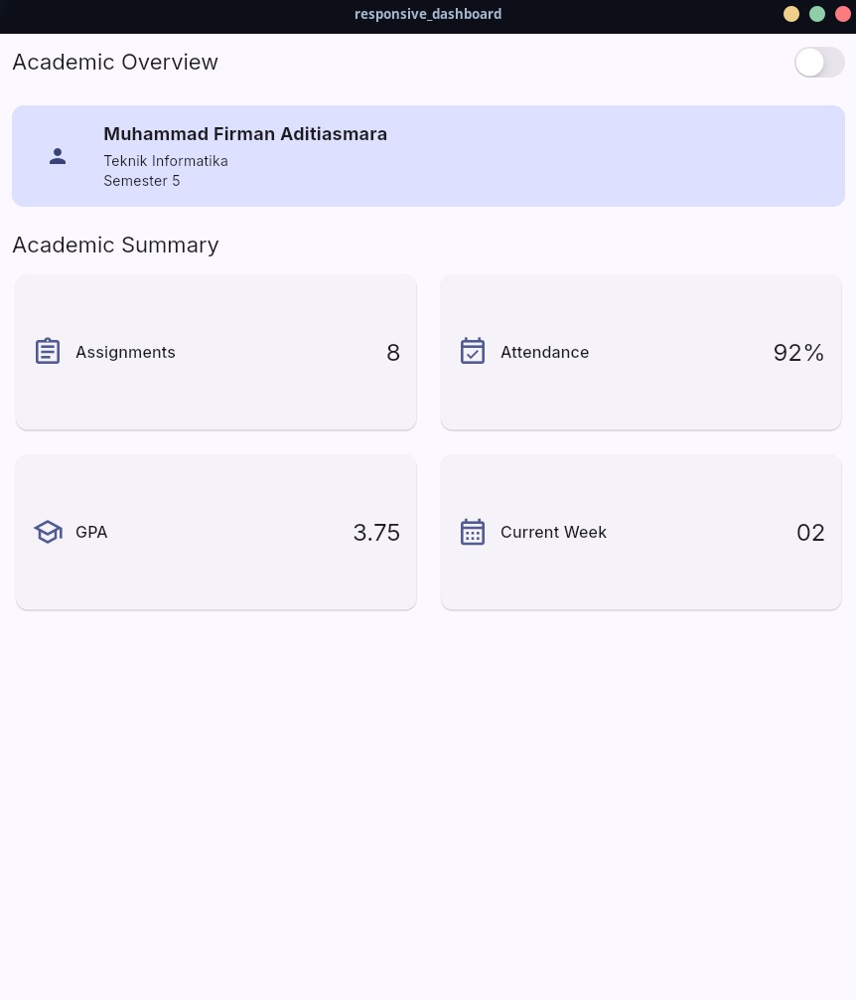
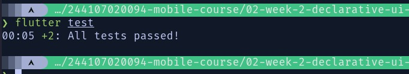

# 02 Week 2: Declarative UI and Responsive Design

## Tujuan Praktikum

- Membangun dashboard akademik sederhana menggunakan Flutter.
- Menyusun tampilan menggunakan `Row`, `Column`, `Container`, dan `Expanded`.
- Membuat layout responsif untuk layar sempit dan layar lebar.
- Menampilkan kartu informasi akademik secara rapi dan mudah dipahami.
- Menerapkan pergantian light theme dan dark theme menggunakan `CupertinoSwitch`.
- Menambahkan `Semantics` agar informasi penting lebih mudah diakses screen reader.
- Membandingkan penggunaan `GridView` dengan `LayoutBuilder + Column`.
- Memahami cara mencegah overflow pada widget `Row` dan `Expanded`.
- Menguji tampilan aplikasi menggunakan ukuran layar yang berbeda.

## Praktikum: Layout Sederhana (Warm-up)

<table>
  <tr>
    <td align="center">
      <strong>Warm-up</strong>  
      
    </td>
  </tr>
</table>

### Eksperimen Warm-up

<table>
  <tr>
    <td align="center">
      <strong>Expanded</strong>  
      
    </td>
    <td align="center">
      <strong>Main Axis</strong>  
      
    </td>
    <td align="center">
      <strong>Email</strong>  
      
    </td>
  </tr>
</table>

## Praktikum: Dashboard Responsif

### Eksperimen Layout

<table>
  <tr>
    <td align="center">
      <strong>Profil+Cuppertino</strong>  
      
    </td>
    <td align="center">
      <strong>Layar Lebar</strong>  
      
    </td>
  </tr>
</table>

## Tugas Utama: Academic Overview

Pada tugas utama, dashboard dikembangkan menjadi halaman **Academic Overview** yang menampilkan informasi akademik mahasiswa secara sederhana dan responsif.

### Fitur yang Diimplementasikan

- Menampilkan header profil mahasiswa.
- Menampilkan nama mahasiswa, program studi, dan semester.
- Menampilkan empat kartu informasi akademik:
  - Assignments
  - Attendance
  - GPA
  - Current Week
- Menggunakan widget `Row` untuk menyusun elemen secara horizontal.
- Menggunakan widget `Column` untuk menyusun informasi secara vertikal.
- Menggunakan `Expanded` agar elemen dapat menyesuaikan ruang yang tersedia.
- Menggunakan `Container` untuk membentuk area header profil.
- Menggunakan `LayoutBuilder` untuk menyesuaikan tampilan berdasarkan ukuran layar.
- Menampilkan satu kolom pada layar sempit.
- Menampilkan dua kolom pada layar lebar.
- Menyediakan light theme dan dark theme.
- Menambahkan toggle tema menggunakan `CupertinoSwitch`.
- Menambahkan label aksesibilitas menggunakan `Semantics`.

Hasil Implementasi
<table>
  <tr>
    <td align="center">
      <strong>Academic Overviewt</strong>  
      
        
      Satu kolom
    </td>
    <td align="center">
      <strong>Academic Layar Lebar</strong>  
      
        
      Dua kolom
    </td>  
  </tr>
</table>

### Hasil
<table>
  <tr>
    <td align="center">
      <strong>Hasil Test</strong>  
      
        
      Semua Tes Berhasil
    </td>
  </tr>
</table>

## Refleksi

### 1. Perbedaan Imperative dan Declarative

Menurut saya, imperative adalah cara membuat UI dengan memberikan perintah satu per satu. Speerti menentukan kapan tampilan harus dibuat atau diubah.

Sedangkan declarative lebih berfokus pada hasil tampilan  berdasarkan kondisi tertentu. Di Flutter, ketika nilai state berubah maka tampilan akan menyesuaikan secara otomatis. Contohnya, saat nilai `isDark` berubah, tema aplikasi ikut berubah.

### 2. Penggunaan Expanded

`Expanded` membantu ketika digunakan di dalam `Row` atau `Column` untuk membagi ruang yang tersedia. Pada dashboard, `Expanded` digunakan agar judul kartu tidak tembus ke luar layar.

Namun, `Expanded` bisa menyebabkan error jika digunakan pada ruang yang tidak memiliki batas ukuran yang jelas. Contohnya adalah `Row` di dalam scroll horizontal. Overflow juga bisa terjadi jika ada widget lain yang memiliki ukuran tetap terlalu besar. 

### 3. Pengaruh Breakpoint dan Theme

Breakpoint menentukan perubahan susunan layout berdasarkan ukuran layar. Pada aplikasi ini, layar sempit menggunakan satu kolom, sedangkan layar lebar menggunakan dua kolom. Hal ini membuat kartu tetap mudah dibaca dan tidak terlalu sempit.

Theme juga memengaruhi kenyamanan pengguna. Light theme lebih cocok digunakan pada kondisi terang, sedangkan dark theme dapat digunakan pada kondisi yang lebih gelap. Warna teks dan latar belakang harus tetap memiliki kontras agar tulisan bisa dibaca pada kedua tema.

### 4. Verifikasi Rekomendasi AI

Setelah tugas utama selesai, saya membandingkan layout `GridView` dengan `LayoutBuilder + Column`. Saya mencoba keduanya pada layar sempit dan layar lebar untuk melihat perubahan jumlah kolom.

Saya juga memeriksa apakah penggunaan `Expanded` menyebabkan overflow, mencoba toggle light theme dan dark theme, serta memastikan label `Semantics` terdapat pada switch tema dan kartu informasi. Selain itu, aplikasi dijalankan pada beberapa ukuran layar untuk memastikan tampilannya tetap responsif.
