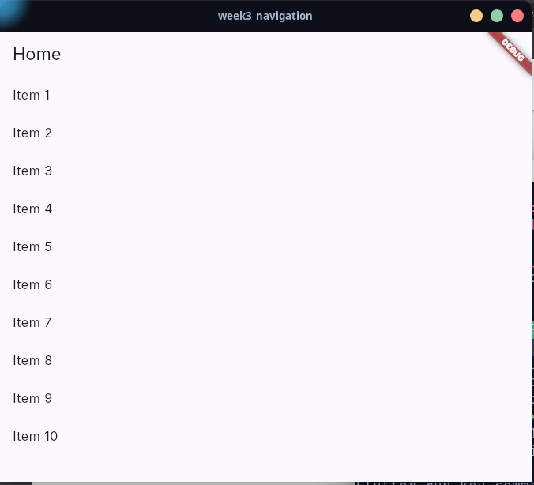
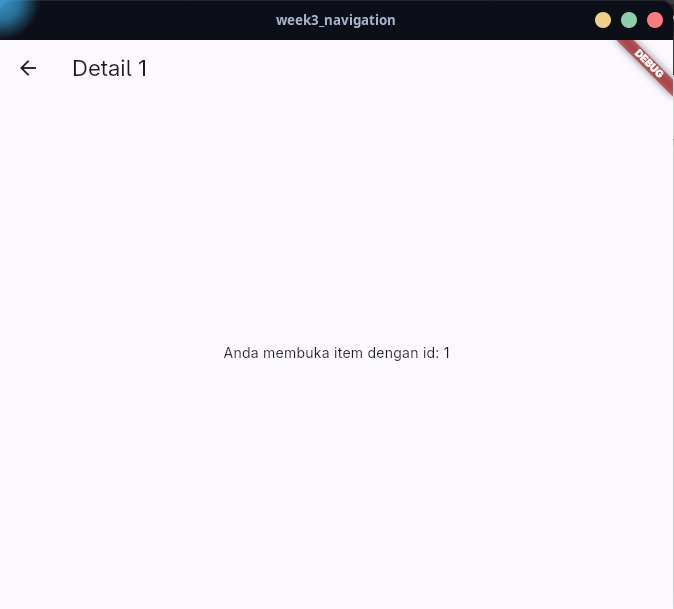
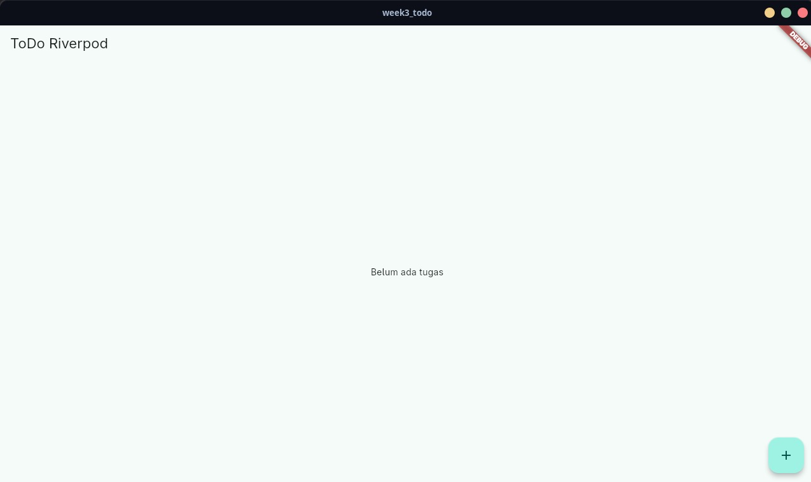
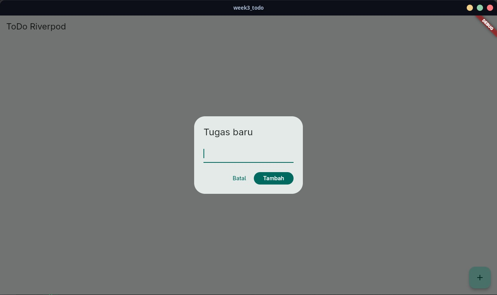

# 03 Week 3: Navigation & State Management

Tugas minggu ke-3 mata kuliah Pemrograman Mobile (JTI Polinema). Proyek ini
menggabungkan navigasi deklaratif dengan **GoRouter** dan state management
dengan **Riverpod**, lalu ditutup dengan simulasi data asinkron memakai
`AsyncValue`.

## Tujuan

- Menjelaskan konsep navigasi, route, serta perbedaan Navigator 1.0 dengan
  GoRouter.
- Menerapkan navigasi multi-page dengan GoRouter, termasuk path parameter dan
  passing argument.
- Menjelaskan alasan state management dan cara kerja Riverpod (`Provider`,
  `ConsumerWidget`, `Notifier`).
- Menangani state loading, error, dan success dengan `AsyncValue`.
- Membangun aplikasi ToDo dengan navigasi dan Riverpod, lalu memverifikasinya
  dengan unit dan widget test.

## Fitur Utama

- Navigasi multi-halaman dengan GoRouter: `/` (daftar tugas), `/produk`
  (produk), dan `/stats` (statistik).
- `NavigationBar` untuk berpindah halaman tanpa kehilangan state.
- Daftar tugas dengan tambah, tandai selesai, dan hapus (`Notifier`).
- Filter tugas: Semua, Aktif, Selesai (provider turunan).
- Halaman produk dengan simulasi pengambilan data asinkron: loading, error
  (dengan tombol **Coba lagi**), dan success.
- Halaman statistik dengan simulasi pengambilan data asinkron: loading, error
  (dengan tombol **Coba lagi**), dan success.

## Stack Teknologi

- Flutter 3.44 (Dart 3.12)
- `go_router` ^18
- `flutter_riverpod` ^3
- `flutter_test` untuk unit dan widget test

## Struktur Folder

```text
03-week-3-navigation-state-management/
├── week3_navigation/             # Project Praktikum 1 (lihat README-nya)
│   └── lib/ test/ ...
├── week3_todo/                   # Project Praktikum 2 & 3 + AI Challenge
│   └── lib/ test/ ...
├── test/                         # Salinan test final (untuk portofolio)
│   ├── todo_provider_test.dart   # Unit test notifier + filter
│   ├── stats_provider_test.dart  # Unit test sukses & gagal
│   └── widget_test.dart          # Widget test tambah tugas & navigasi
├── docs/
│   └── ai-challenge.md           # Prompt, output AI, perbaikan, hasil test
├── screenshots/
└── README.md
```

> Kode yang dapat dijalankan ada di subfolder `week3_navigation/` dan
> `week3_todo/` (di-ignore oleh Git). Folder `test/` di root berisi salinan
> test final untuk dokumentasi portofolio.

## Struktur Project

Folder ini punya README keseluruhan (file ini) dan README tiap project:

- `week3_navigation/` - Praktikum 1 (navigasi GoRouter). Struktur: `lib/`
  (`main.dart`, `pages/home_page.dart`, `pages/detail_page.dart`) dan `test/`.
  Cara jalan dan detailnya ada di
  [`week3_navigation/README.md`](week3_navigation/README.md).
- `week3_todo/` - Praktikum 2 & 3 + AI Challenge (ToDo + Riverpod). Struktur:
  `lib/` (`main.dart`, `pages/`, `providers/`, `widgets/`) dan `test/`.
  Cara jalan dan detailnya ada di
  [`week3_todo/README.md`](week3_todo/README.md).

Folder `test/` di root adalah salinan test final `week3_todo/` untuk
dokumentasi portofolio. `screenshots/` dan `docs/` juga berada di root folder.

## Praktikum 1 - Navigasi dengan GoRouter

Proyek `week3_navigation` menampilkan daftar 10 item. Menekan sebuah item
membuka `/detail/:id` lewat path parameter, dan path detail dapat diakses
langsung tanpa melewati Home.

<table>
  <tr>
    <td align="center">
      <strong>Home</strong><br><br>
      
    </td>
    <td align="center">
      <strong>Detail</strong><br><br>
      
    </td>
  </tr>
</table>

## Praktikum 2 - ToDo dengan Riverpod

State daftar tugas disimpan pada `TodoListNotifier` dan dibaca UI lewat
`ref.watch`. Setiap perubahan selalu membuat list baru (immutable), dan
callback memakai `ref.read(...notifier)`.

<table>
  <tr>
    <td align="center">
      <strong>Daftar Tugas</strong><br><br>
      
    </td>
    <td align="center">
      <strong>Tambah Tugas</strong><br><br>
      
    </td>
  </tr>
</table>

## Praktikum 3 - AsyncValue dan AI Challenge

Halaman `StatsPage` memakai `AsyncNotifier` yang mensimulasikan request
(delay 2 detik, gagal sekitar 30%). Ketiga kondisi ditangani dengan
`AsyncValue.when`:

- **loading**: spinner + label "Memuat statistik..."
- **error**: pesan gagal + tombol **Coba lagi** (`ref.invalidate`)
- **success**: panel cincin persentase selesai + `ListView` tiga baris
  (Total tugas, Selesai, Belum selesai)
- **empty**: saat belum ada tugas, ditampilkan pesan + tombol menuju tab Tugas

Statistik dihitung dari daftar tugas sebenarnya (total, selesai, belum
selesai), bukan angka hardcoded, dan dibungkus model `Stats` di
`providers/stats_provider.dart`. Detail prompt, output awal AI, perbaikan,
keputusan visual, dan hasil test ada di
[`docs/ai-challenge.md`](docs/ai-challenge.md).

## Refactoring Challenge

1. **`TodoTile`** dipisah menjadi widget tersendiri di `lib/widgets/`.
2. **Logika filter** diekstrak menjadi `filteredTodosProvider`, sebuah
   `Provider` turunan yang membaca `todoListProvider` dan `todoFilterProvider`.
3. **Integrasi GoRouter**: `/` untuk daftar tugas, `/produk` untuk produk, dan
   `/stats` untuk statistik, dengan `NavigationBar` untuk berpindah halaman.

## Testing

```bash
flutter test
```

Hasil:

```text
00:00 +0: add, toggle, dan remove menghasilkan state baru
00:00 +1: filteredTodosProvider mengikuti filter
00:00 +2: statistik sukses menghitung total, selesai, dan sisa
00:00 +3: statistik gagal memunculkan AsyncError
00:00 +4: menambah tugas baru
00:01 +5: berpindah ke halaman statistik lewat GoRouter
00:02 +6: All tests passed!
```

Analisis statis:

```bash
dart analyze   # No issues found!
```

## Cara Menjalankan

```bash
cd week3_todo
flutter pub get
flutter run
```

Aplikasi membuka halaman **Tugas** lebih dulu. Tab **Tugas**, **Produk**, dan
**Statistik** tersedia lewat `NavigationBar` di bawah.

## AI Verification Checklist

| Item | Status | Catatan |
| :--- | :---: | :--- |
| State diubah secara immutable | ✅ | `add`/`toggle`/`remove` selalu membuat list baru |
| `ref.watch` di `build`, `ref.read` di callback | ✅ | Tidak ada `watch` di dalam callback |
| Ketiga state AsyncValue ditangani | ✅ | loading, error, dan success |
| Provider bertipe eksplisit dan tidak duplikat | ✅ | `NotifierProvider` / `AsyncNotifierProvider` |
| Tidak memakai API Riverpod lama | ✅ | `StateProvider` usulan AI diganti `NotifierProvider` |
| `flutter analyze` dan `flutter test` lolos | ✅ | `dart analyze` bersih, 6 test lulus |

## Refleksi

1. **Kapan `setState` cukup, kapan harus Riverpod?**
   `setState` cukup untuk state lokal yang hanya dipakai satu widget, misalnya
   membuka dialog atau toggle tema. Riverpod dipakai ketika state dibagi antar
   halaman (daftar tugas yang tampil di Home dan dihitung di Statistik) atau
   harus bertahan saat widget tidak tampil.
2. **`context.go` vs `context.push`?**
   `go` mengganti stack dan cocok untuk redirect atau berpindah tab, sedangkan
   `push` menumpuk halaman baru di atas stack sehingga tombol back kembali ke
   halaman sebelumnya. Pada `NavigationBar` dipakai `go` karena perpindahan tab
   tidak perlu menumpuk.
3. **Bagaimana `AsyncValue` mencegah bug dibanding tiga boolean?**
   Tiga boolean (`isLoading`, `hasError`, `hasData`) bisa berada di kombinasi
   yang tidak masuk akal, misalnya loading dan error bersamaan. `AsyncValue`
   adalah satu tipe dengan tiga kondisi yang saling eksklusif, jadi UI tidak
   mungkin menampilkan kondisi yang mustahil.
4. **Bagian hasil AI yang diperbaiki?**
   Menambahkan injeksi `Random`/delay agar unit test deterministik,
   menonaktifkan auto-retry Riverpod 3 agar error state bertahan, memakai
   `AsyncValue.guard`, mengganti `StateProvider` dengan `NotifierProvider`,
   serta memperbaiki operasi todo dari berbasis index menjadi berbasis objek
   agar tetap benar saat filter aktif.

## Checklist Verifikasi Mandiri

- [x] Navigasi GoRouter bekerja: pindah halaman, back, dan akses path detail
      langsung.
- [x] `ProviderScope` membungkus root aplikasi; state ToDo bertahan saat
      berpindah halaman.
- [x] UI `AsyncValue` menangani loading, error, dan success, bukan hanya
      success.
- [x] `flutter analyze` tanpa issue dan semua test lulus.
- [x] Hasil AI diverifikasi dan didokumentasikan pada folder `docs/`.
