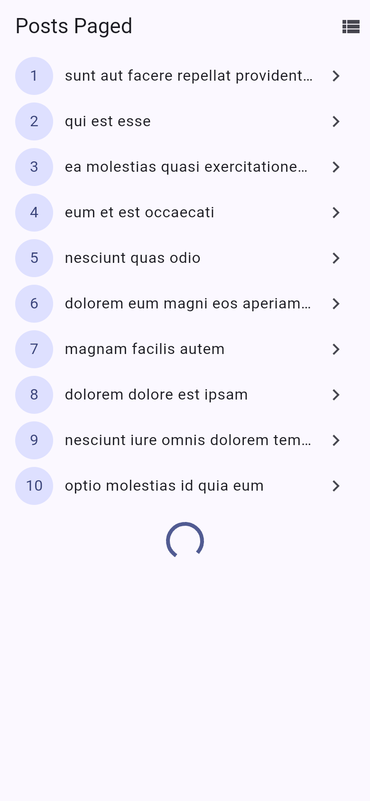
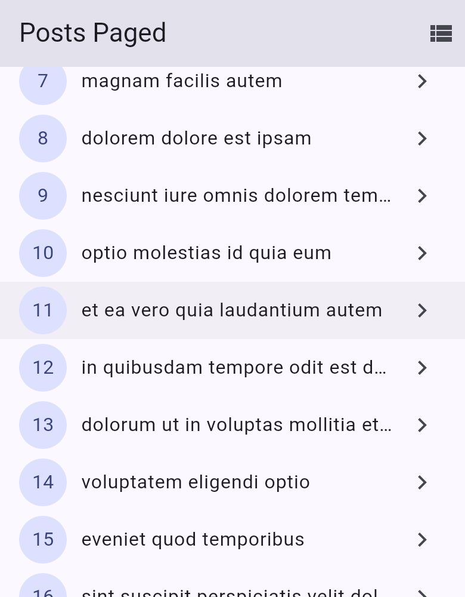
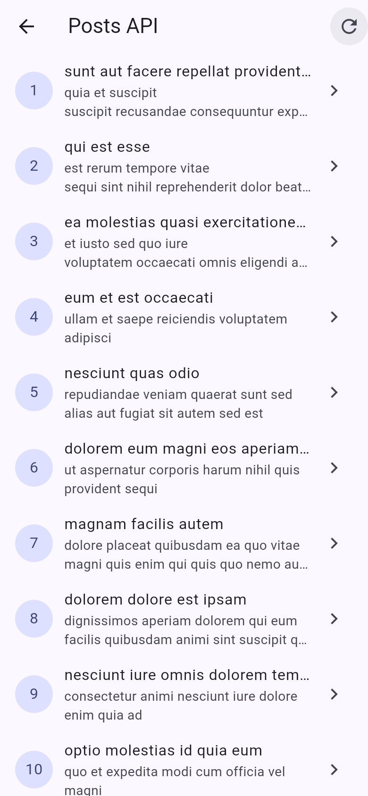
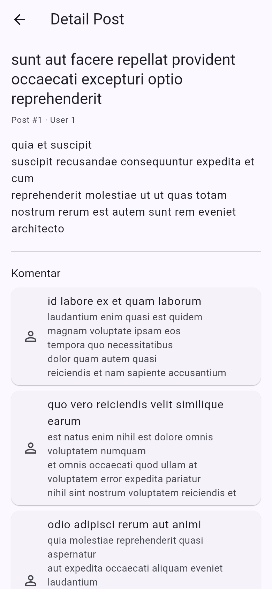
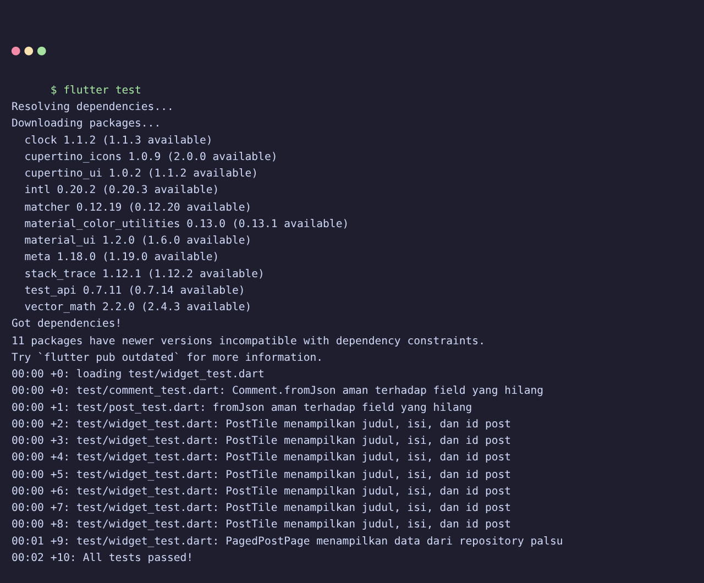

# 04 Week 4: Networking & REST API

Tugas minggu ke-4 mata kuliah Pemrograman Mobile (JTI Polinema). Proyek ini
mengambil data dari REST API publik, memetakannya ke model Dart yang aman null,
dan menampilkannya lewat repository + Riverpod dengan penanganan state loading,
error, empty, dan success, ditutup dengan pagination (infinite scroll).

## Tujuan

- Menjelaskan konsep HTTP, REST API, dan JSON.
- Memetakan JSON ke model Dart dengan `fromJson` yang aman null.
- Menerapkan repository pattern sehingga UI tidak memanggil API secara langsung.
- Mengonfigurasi Dio (base URL, timeout, interceptor) di satu tempat.
- Menampilkan state loading, error, empty, dan success dengan `AsyncValue`.
- Menerapkan pagination dasar (infinite scroll) dengan guard request ganda.

## Fitur Utama

- Klien HTTP terpusat `dio` dengan `baseUrl`, timeout 10 detik, dan
  `LogInterceptor`.
- Model `Post` dan `Comment` dengan `fromJson` aman null.
- `PostRepository` (`fetchPosts`, `fetchPost`, `fetchPostsPage`) dan
  `CommentRepository` (`fetchComments`) sebagai satu-satunya pintu ke API.
- Halaman daftar penuh (`/simple`) dengan keempat state: loading, error +
  tombol **Coba lagi**, empty, dan success.
- Halaman paginated (`/`) dengan infinite scroll 10 item per halaman dan
  indikator akhir data.
- Halaman detail (`/post/:id`) menampilkan judul, isi, dan komentar dari
  endpoint `GET /comments?postId={id}`.
- Pesan error ramah pengguna untuk timeout, connection error, 404, dan 5xx.
- 10 test lulus (unit test model + error mapping, provider dengan repository
  palsu, dan widget test) tanpa HTTP sungguhan.

## Stack Teknologi

- Flutter 3.44 (Dart 3.12)
- `dio` ^5.11
- `flutter_riverpod` ^3
- `go_router` ^18
- `flutter_test` untuk unit dan widget test

## Struktur Folder

```text
04-week-4-networking-rest-api/
├── week4_api/                 # Project Flutter yang dapat dijalankan
│   ├── lib/
│   │   ├── main.dart          # ProviderScope + GoRouter (/ , /simple, /post/:id)
│   │   ├── data/
│   │   │   ├── api_client.dart          # createDio() terpusat
│   │   │   ├── providers.dart           # dioProvider, repository, notifier
│   │   │   ├── paged_post.dart          # PagedPostsState + notifier
│   │   │   ├── network_errors.dart      # friendlyErrorMessage
│   │   │   ├── models/ (post.dart, comment.dart)
│   │   │   └── repositories/ (post_repository.dart, comment_repository.dart)
│   │   ├── pages/ (post_list_page.dart, paged_post_page.dart, post_detail_page.dart)
│   │   └── widgets/post_tile.dart
│   └── test/
│       ├── post_test.dart     # fromJson, error mapping, provider sukses/gagal
│       ├── comment_test.dart  # Comment.fromJson + 404 + provider komentar
│       ├── widget_test.dart   # PostTile & PagedPostPage
│       └── fakes.dart         # repository palsu (tanpa HTTP)
├── lib/                       # Salinan kode final (untuk portofolio)
├── test/                      # Salinan test final (untuk portofolio)
├── docs/
│   └── ai-challenge.md        # Prompt, output AI, perbaikan, hasil test
├── screenshots/
└── README.md
```

> Kode yang dapat dijalankan ada di subfolder `week4_api/` (di-ignore oleh Git).
> Folder `lib/` dan `test/` di root berisi salinan final untuk dokumentasi
> portofolio, mengikuti konvensi minggu sebelumnya.

## Alur Data

```text
UI (ConsumerWidget) --watch--> Provider (AsyncValue)
Provider --panggil--> Repository --pakai--> Dio --HTTP--> REST API
```

UI tidak pernah memanggil Dio langsung. Repository mengubah exception jaringan
menjadi kegagalan yang bermakna bagi pengguna lewat `friendlyErrorMessage`,
dan provider mengekspos `AsyncValue` ke UI.

## 1. Model data dengan `fromJson` aman null

`Post` dan `Comment` memakai cast defensif `as String? ?? ''` dan
`(as num?)?.toInt() ?? 0` agar respons API yang tidak sesuai dokumentasi tidak
membuat aplikasi crash dengan `type 'Null' is not a subtype`.

## 2. Dio terpusat

Seluruh konfigurasi jaringan hidup di `lib/data/api_client.dart`. `baseUrl`
dapat ditimpa saat build/run untuk menguji error:

```bash
flutter run --dart-define=API_BASE_URL=https://localhost:9/
```

## 3. Empat state UI

Setiap state mendapat tampilannya sendiri:

- **loading**: `CircularProgressIndicator`.
- **error**: pesan ramah + tombol **Coba lagi** (`ref.invalidate`).
- **empty**: teks "Belum ada data dari server." / "Semua data termuat."
- **success**: daftar `PostTile` dengan `RefreshIndicator`.

<table>
  <tr>
    <td align="center"><strong>Loading</strong><br><br>
      </td>
    <td align="center"><strong>Success</strong><br><br>
      </td>
    <td align="center"><strong>Error</strong><br><br>
      </td>
  </tr>
</table>

Empty state saat server tidak mengembalikan data:

<p align="center">
  
</p>

## 4. Pagination (infinite scroll)

`ScrollController` memicu halaman berikutnya 200px sebelum ujung list. Guard
`if (state.isLoadingMore || !state.hasMore) return;` mencegah request ganda dan
menghentikan request saat data habis, sementara data lama tetap dipertahankan
saat halaman berikutnya gagal.

<table>
  <tr>
    <td align="center"><strong>Infinite scroll (halaman 1 → 2)</strong><br><br>
      </td>
    <td align="center"><strong>Daftar penuh (<code>/simple</code>)</strong><br><br>
      </td>
  </tr>
</table>

## 5. Halaman detail + komentar (AI Challenge)

Halaman `/post/:id` menampilkan judul dan isi lengkap. Bila dibuka dari daftar,
data dikirim lewat `extra`; bila dibuka langsung, `postDetailProvider` mengambil
ulang dari repository. Komentar diambil dari `GET /comments?postId={id}`.

<p align="center">
  
</p>

Detail prompt, output awal AI, verifikasi, dan perbaikan ada di
[`docs/ai-challenge.md`](docs/ai-challenge.md).

## Refactoring Challenge

1. **`PostTile`** dipisah menjadi widget tersendiri di `lib/widgets/` agar
   `ListView.builder` pendek dan mudah diuji.
2. **`friendlyErrorMessage`** dipindah ke `lib/data/network_errors.dart` agar
   dipakai ulang halaman paged, non-paged, dan detail.
3. **Halaman detail** `/post/:id` dengan GoRouter menampilkan `title` dan `body`
   lengkap, dengan state detail dari list yang sudah dimuat atau via repository
   bila dibuka langsung.

## Testing

```bash
cd week4_api
dart analyze
flutter test
```

Hasil:

```text
Analyzing week4_api...
No issues found!

00:00 +0: loading test/widget_test.dart
00:00 +0: test/comment_test.dart: Comment.fromJson aman terhadap field yang hilang
00:00 +1: test/post_test.dart: fromJson aman terhadap field yang hilang
00:00 +2: test/widget_test.dart: PostTile menampilkan judul, isi, dan id post
...
00:01 +9: test/widget_test.dart: PagedPostPage menampilkan data dari repository palsu
00:02 +10: All tests passed!
```

<table>
  <tr>
    <td align="center"><strong><code>dart analyze</code></strong><br><br>
      </td>
    <td align="center"><strong><code>flutter test</code></strong><br><br>
      </td>
  </tr>
</table>

## Cara Menjalankan

```bash
cd week4_api
flutter pub get
flutter run
```

Aplikasi membuka halaman **Posts Paged** (`/`). Ikon daftar di kanan atas
membuka daftar penuh (`/simple`), dan menekan sebuah post membuka halaman
detail (`/post/:id`).

## AI Verification Checklist

| Item | Status | Catatan |
| :--- | :---: | :--- |
| UI tidak memanggil Dio langsung | ✅ | UI hanya `ref.watch` provider |
| `fromJson` aman null | ✅ | `as String? ?? ''`, `(as num?)?.toInt() ?? 0` |
| Semua `DioExceptionType` dipetakan | ✅ | timeout, connectionError, badResponse (404/401/403/5xx) |
| `baseUrl`/timeout terpusat | ✅ | `createDio()` di `api_client.dart` |
| Test menguji field hilang + edge case | ✅ | Field hilang, 404, provider sukses/gagal |
| `dart analyze` dan `flutter test` lolos | ✅ | Bersih, 10 test lulus |

## Checklist Verifikasi Mandiri

- [x] UI tidak memanggil Dio langsung, semua akses data lewat repository +
      provider.
- [x] Empat state tampil benar: loading, error (+ retry), empty, success.
- [x] Pagination: data bertambah saat scroll, tidak ada request ganda, ada
      indikator akhir data.
- [x] `dart analyze` tanpa issue dan semua test lulus.
- [x] Hasil AI diverifikasi dan didokumentasikan pada folder `docs/`.

## Refleksi

1. **Mengapa UI dilarang memanggil Dio langsung?**
   Karena UI jadi sulit diuji (butuh jaringan sungguhan), sulit diganti sumber
   datanya, dan pemetaan error tersebar di banyak widget. Dengan repository,
   UI hanya bergantung pada provider dan bisa diuji dengan repository palsu.
2. **Kapan pagination client-side cukup, kapan server-side?**
   Client-side cukup bila seluruh data kecil dan sudah dimuat sekaligus.
   Server-side (`_page`/`_limit`) dipakai bila data besar, karena hanya halaman
   yang dibutuhkan yang dikirim dan memori perangkat tetap hemat.
3. **Bagaimana exception menjadi `AsyncError` tanpa try/catch di tiap widget?**
   `AsyncNotifier.build` yang melempar exception otomatis diubah Riverpod
   menjadi `AsyncError`. `try/catch` eksplisit tetap dipakai di `refresh()`
   karena kita ingin menetapkan state secara manual tanpa membuang data lama.
4. **Bagian hasil AI yang diperbaiki?**
   Timeout dipindah ke client terpusat, pemetaan error diperluas untuk semua
   `DioExceptionType`, auto-retry Riverpod 3 dinonaktifkan agar error bertahan,
   dan test ditambah edge case 404 serta provider sukses/gagal.
