# 05 Week 5: Local Storage & Offline First

Tugas minggu ke-5 mata kuliah Pemrograman Mobile (JTI Polinema). Proyek ini
menyimpan preferensi dengan `SharedPreferences` dan catatan dengan SQLite
(`sqflite`) melalui repository lokal + Riverpod, lalu menerapkan pola
**offline-first**: cache-first read, dirty flag, dan antrean sinkronisasi.

## Tujuan

- Menjelaskan perbedaan penyimpanan key-value, relasional, dan NoSQL.
- Menyimpan preferensi sederhana (tema, terakhir dibuka) dengan SharedPreferences.
- Menerapkan CRUD catatan dengan SQLite (sqflite) melalui repository lokal.
- Menerapkan pola offline-first: cache-first read, dirty flag, antrean sinkronisasi.
- Menampilkan state loading, error, empty, dan success untuk data lokal.
- Menguji repository lokal dengan repository palsu (tanpa database sungguhan).

## Fitur Utama

- **Preferensi** (tema gelap/terang + waktu terakhir dibuka) lewat
  `PrefsRepository` + `SharedPreferences`.
- **CRUD catatan** persisten via SQLite melalui `NoteRepository` + Riverpod,
  daftar diurutkan `updated_at` terbaru.
- **Offline-first**: badge "Belum tersinkron" (dirty flag) dan tombol **Sync**
  yang menandai catatan bersih hanya setelah "server" menjawab sukses.
- **Cache-first read** untuk `GET /posts` JSONPlaceholder: cache lokal tampil
  seketika, refresh jaringan di background, hasilnya disimpan ke tabel
  `cached_posts`.
- **Simulasi offline deterministik** lewat toggle `forceOffline` (provider).
- **Halaman detail catatan** `/note/:id` dengan GoRouter yang membaca langsung
  dari repository lokal.
- 7 test lulus (unit test model + provider dengan repository palsu + widget test)
  tanpa SQLite/HTTP sungguhan.

## Stack Teknologi

- Flutter 3.44 (Dart 3.12)
- `flutter_riverpod` ^3
- `shared_preferences` ^2
- `sqflite` ^2 + `path`
- `dio` ^5
- `go_router` ^18
- `sqflite_common_ffi_web` (dukungan web untuk demo/screenshot)
- `flutter_test` untuk unit dan widget test

## Struktur Folder

```text
05-week-5-local-storage-offline-first/
├── week5_offline_notes/        # Project Flutter yang dapat dijalankan
│   ├── lib/
│   │   ├── main.dart           # ProviderScope + GoRouter (/ , /settings, /posts, /note/:id)
│   │   ├── data/
│   │   │   ├── prefs.dart               # PrefsRepository (SharedPreferences)
│   │   │   ├── providers.dart           # provider Riverpod + AsyncNotifier
│   │   │   ├── sync.dart                # syncNotes + cache posts
│   │   │   ├── api_client.dart          # createDio() terpusat
│   │   │   ├── network_errors.dart      # friendlyErrorMessage + OfflineException
│   │   │   ├── local/
│   │   │   │   ├── db.dart              # openNotesDb() + skema
│   │   │   │   ├── note.dart            # model Note (dirty flag)
│   │   │   │   └── notes_database_factory*.dart  # io/web factory
│   │   │   ├── models/post.dart
│   │   │   └── repositories/
│   │   │       ├── note_repository.dart # satu-satunya pintu ke tabel notes
│   │   │       └── post_repository.dart
│   │   ├── pages/ (notes_page.dart, settings_page.dart, posts_page.dart, note_detail_page.dart)
│   │   └── widgets/note_tile.dart       # NoteTile + DirtyBadge
│   └── test/
│       ├── note_test.dart      # model + provider dengan repository palsu
│       ├── widget_test.dart    # NoteTile
│       └── fakes.dart          # FakeNoteRepository (tanpa SQLite)
├── lib/                        # Salinan kode final (untuk portofolio)
├── test/                       # Salinan test final (untuk portofolio)
├── docs/
│   └── ai-challenge.md         # Prompt, output AI, verifikasi, keputusan final
├── screenshots/
└── README.md
```

> Kode yang dapat dijalankan ada di subfolder `week5_offline_notes/`
> (di-ignore oleh Git). Folder `lib/` dan `test/` di root berisi salinan final
> untuk dokumentasi portofolio, mengikuti konvensi minggu sebelumnya.

## Alur Data

```text
UI (ConsumerWidget) --watch--> Provider (AsyncValue)
Provider --panggil--> LocalRepository --CRUD--> SQLite
LocalRepository --sync--> Remote (simulasi) --sukses--> dirty = 0
Cache: baca lokal dulu, refresh background, simpan
```

UI tidak pernah memanggil SQLite/SharedPreferences langsung. Repository mengubah
exception platform menjadi kegagalan bermakna lewat `friendlyErrorMessage`, dan
provider mengekspos `AsyncValue` ke UI.

## 1. Preferensi (SharedPreferences)

`PrefsRepository` memusatkan seluruh akses key-value: `getDarkMode`,
`setDarkMode`, `markOpenedNow`, dan `getLastOpened`. `DarkModeNotifier`
membungkusnya dalam `AsyncNotifierProvider`.

<table>
  <tr>
    <td align="center"><strong>Pengaturan (tema terang)</strong><br><br>
      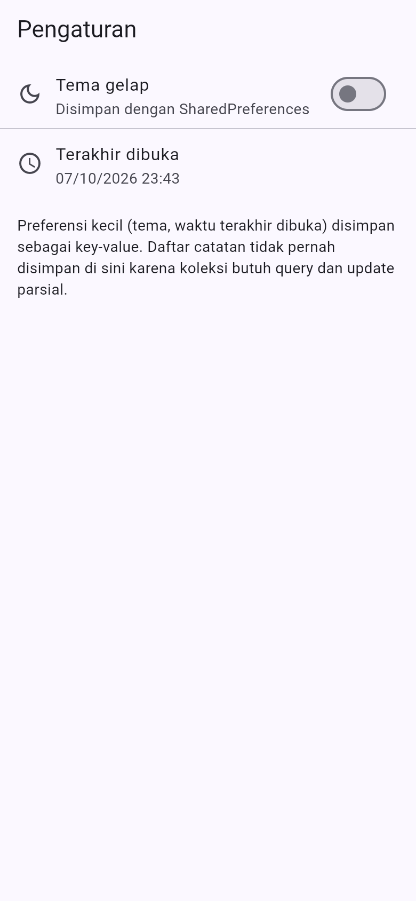</td>
    <td align="center"><strong>Pengaturan (tema gelap)</strong><br><br>
      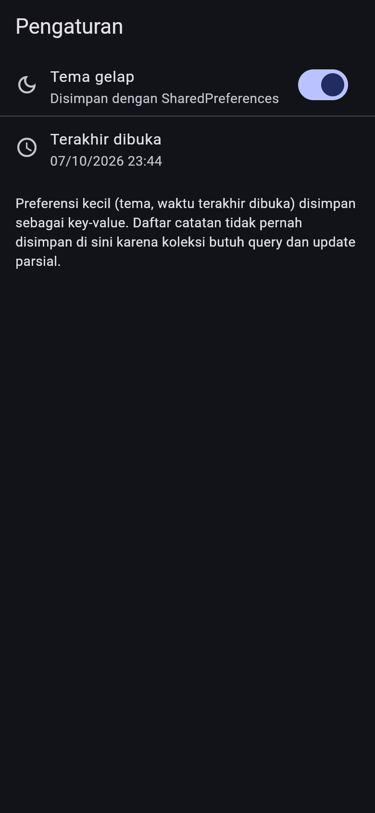</td>
  </tr>
</table>

## 2. CRUD catatan offline (SQLite)

Catatan tersimpan di perangkat sehingga halaman ini tetap berfungsi penuh dalam
mode pesawat. `NoteTile` menampilkan badge **Belum tersinkron** bila
`dirty == true`.

<table>
  <tr>
    <td align="center"><strong>Daftar catatan + badge dirty</strong><br><br>
      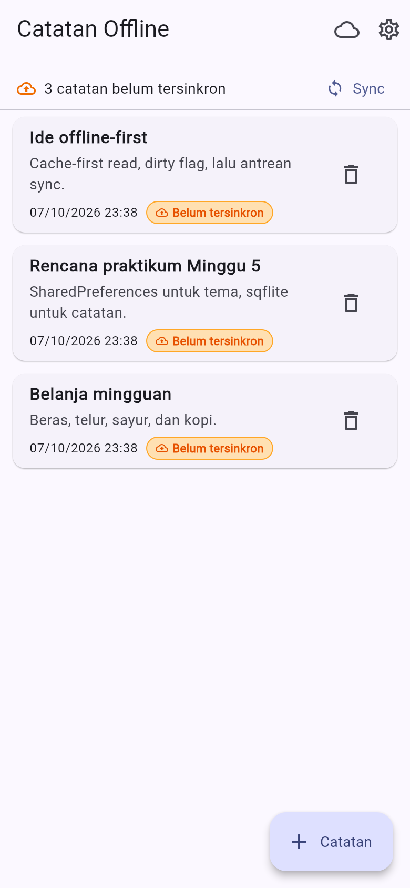</td>
    <td align="center"><strong>Detail badge "Belum tersinkron"</strong><br><br>
      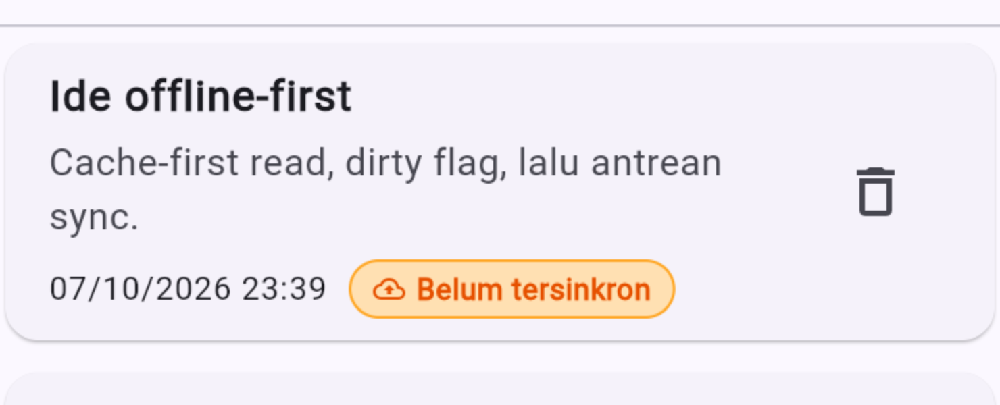</td>
    <td align="center"><strong>Tambah catatan</strong><br><br>
      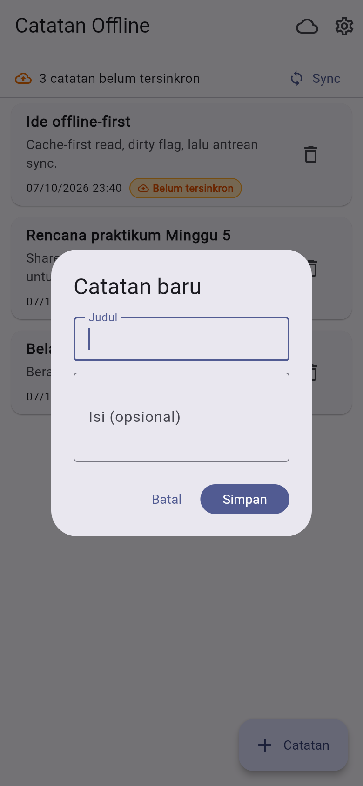</td>
  </tr>
</table>

Halaman detail `/note/:id` membaca langsung dari repository lokal, bukan dari
state halaman list:

<p align="center">
  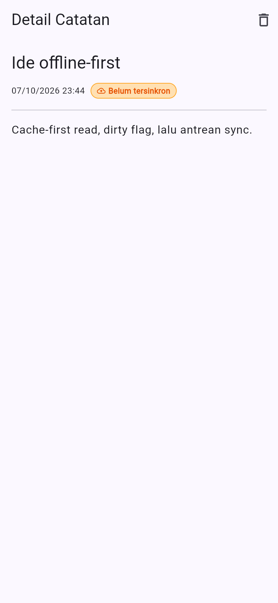
</p>

## 3. Dirty flag + antrean sinkronisasi

Setiap perubahan lokal ditandai `dirty = 1`. Tombol **Sync** memanggil
`syncNotes()` yang menghitung catatan kotor, menyimulasikan upload, lalu
memanggil `markAllSynced()`. Badge kembali ke nol setelah sync sukses.

<table>
  <tr>
    <td align="center"><strong>Sebelum sync (3 dirty)</strong><br><br>
      </td>
    <td align="center"><strong>Sesudah sync (0 dirty)</strong><br><br>
      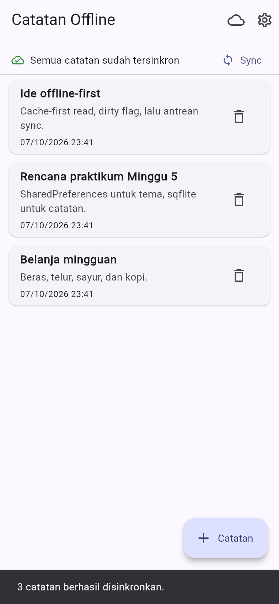</td>
  </tr>
</table>

## 4. Bukti mode pesawat

Catatan tetap tampil, bisa ditambah, dan badge dirty tetap akurat tanpa
jaringan. Toggle `forceOffline` membuat simulasi deterministik (tidak
bergantung kondisi Wi-Fi kelas).

<p align="center">
  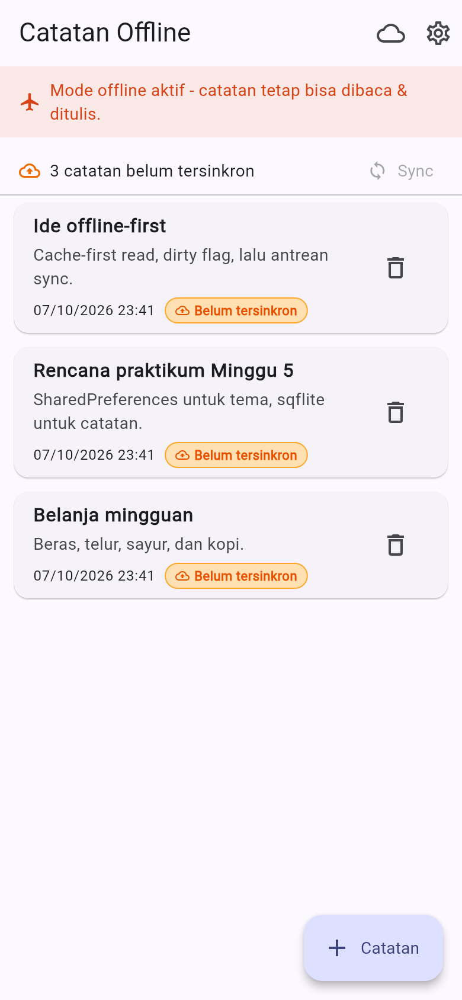
</p>

## 5. Cache-first read untuk data API

Halaman **Data API** menampilkan cache lokal seketika (tabel `cached_posts`),
lalu refresh dari `GET /posts` di background dan menyimpan hasilnya. Bila
refresh gagal, cache tetap tampil dengan penanda error.

<table>
  <tr>
    <td align="center"><strong>Dari cache lokal (offline)</strong><br><br>
      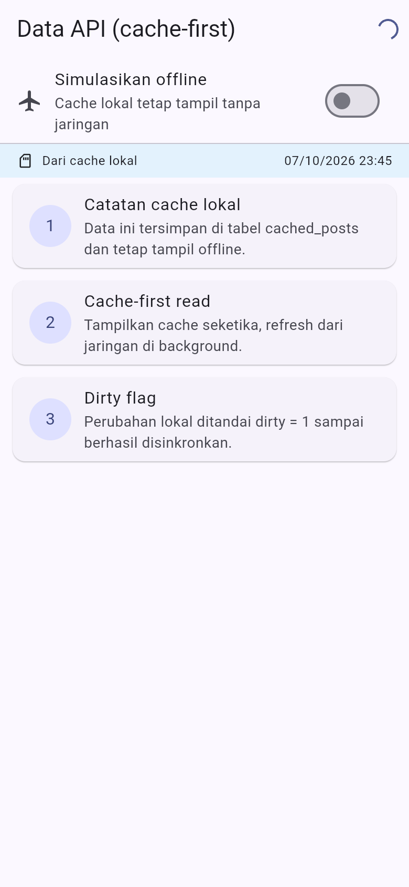</td>
    <td align="center"><strong>Dari jaringan (tersimpan ke cache)</strong><br><br>
      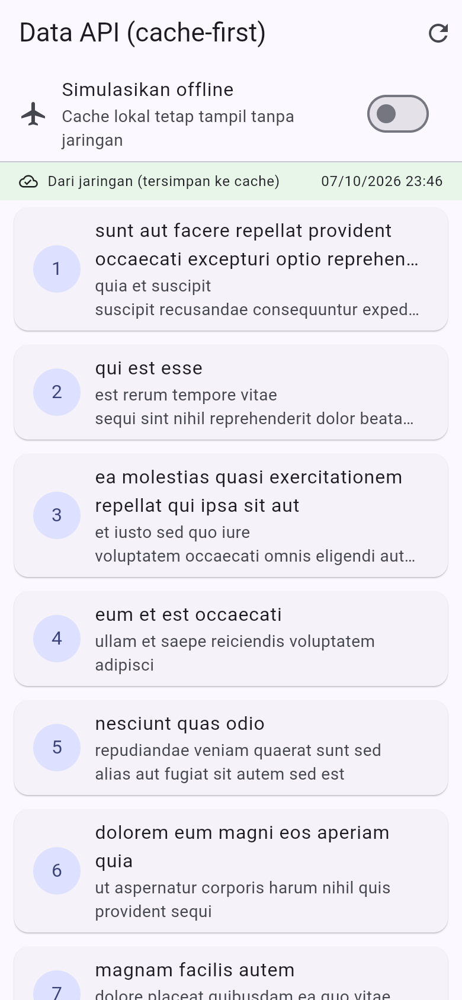</td>
    <td align="center"><strong>Refresh gagal, cache tetap tampil</strong><br><br>
      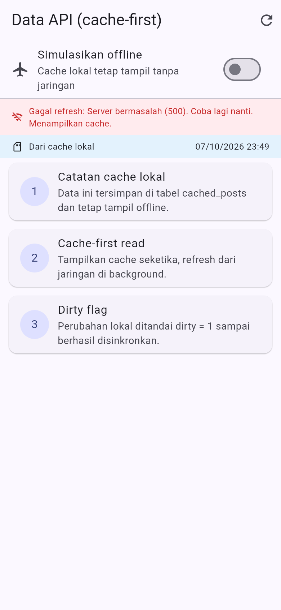</td>
  </tr>
</table>

### Aturan konflik

Dipilih **last-write-wins berdasarkan `updated_at`**. Catatan diurutkan
`updated_at DESC`, dan saat sinkronisasi catatan dengan `updated_at` terbaru
dianggap menang. Aturan ini eksplisit agar sinkronisasi dua arah tidak menimpa
data secara diam-diam.

## Refactoring Challenge

1. **`NoteTile`** diekstrak menjadi widget tersendiri di `lib/widgets/` dengan
   badge "Belum tersinkron" saat `dirty == true`.
2. **`sync.dart`** memuat logika cache posts dan `syncNotes` agar repository
   tetap fokus pada CRUD.
3. **Halaman detail** `/note/:id` dengan GoRouter membaca dari repository lokal
   (`noteDetailProvider`), bukan dari state halaman list.

## Testing

```bash
cd week5_offline_notes
dart analyze
flutter test
```

Hasil:

```text
$ dart analyze
Analyzing week5_offline_notes...
No issues found!

$ flutter test
00:00 +0: test/note_test.dart: fromMap aman terhadap field yang hilang
00:00 +1: test/note_test.dart: flag dirty bertahan pada serialisasi
00:00 +2: test/widget_test.dart: NoteTile menampilkan badge belum tersinkron
00:00 +3: test/note_test.dart: provider sukses dengan repository palsu
00:00 +4: test/note_test.dart: provider error dengan repository palsu
00:00 +5: test/note_test.dart: countDirty menghitung catatan belum tersinkron
00:00 +6: test/widget_test.dart: NoteTile tidak menampilkan badge saat sinkron
00:00 +7: All tests passed!
```

<p align="center">
  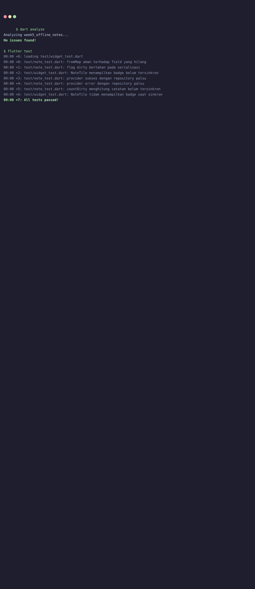
</p>

## Cara Menjalankan

```bash
cd week5_offline_notes
flutter pub get
flutter run                 # Android/desktop
flutter run -d chrome       # Web (butuh sqflite_common_ffi_web)
```

Aplikasi membuka **Catatan Offline** (`/`). Ikon cloud membuka halaman Data API
(`/posts`), ikon gerigi membuka Pengaturan (`/settings`), dan menekan sebuah
catatan membuka detail (`/note/:id`).

## AI Verification Checklist

| Item | Status | Catatan |
| :--- | :---: | :--- |
| AI menempatkan daftar catatan di SharedPreferences? | ✅ Tidak | AI menyarankan sqflite untuk koleksi |
| Skema mendukung antrean sync (dirty / updated_at)? | ⚠️ Diperbaiki | AI hanya punya `updated_at`; ditambah `dirty` |
| Klaim "real-time" didukung stream? | ✅ | Reaktivitas via Riverpod, bukan asumsi |
| Estimasi boilerplate masuk akal? | ✅ | `flutter pub add sqflite path` ringan |
| Test menguji field hilang + repository palsu? | ✅ | `note_test.dart` + `FakeNoteRepository` |
| `dart analyze` dan `flutter test` lolos | ✅ | Bersih, 7 test lulus |

## Checklist Verifikasi Mandiri

- [x] UI tidak memanggil SQLite/SharedPreferences langsung; semua lewat
      repository + provider.
- [x] Aplikasi penuh berfungsi dalam mode pesawat: baca, tambah, hapus catatan.
- [x] Badge dirty akurat sebelum/sesudah sync; cache posts tampil tanpa internet.
- [x] `dart analyze` tanpa issue dan semua test lulus.
- [x] Hasil AI diverifikasi dan didokumentasikan pada folder `docs/`.

## Refleksi

1. **Mengapa daftar catatan tidak boleh disimpan di SharedPreferences?**
   SharedPreferences hanya untuk nilai primitif kecil. Menyimpan koleksi sebagai
   satu string JSON membuat query, update parsial, dan sinkronisasi rapuh dan
   lambat, serta tidak ada transaksi.
2. **Kapan cache-first cukup, kapan butuh network-first?**
   Cache-first cukup untuk data yang boleh sedikit basi (daftar post, katalog).
   Network-first dipakai untuk data yang harus akurat saat itu juga, misalnya
   harga atau saldo.
3. **Bagaimana dirty flag menjadi antrean sync tanpa memblokir UI?**
   Perubahan lokal langsung menulis ke SQLite dan menandai `dirty = 1`; UI
   selesai tanpa menunggu jaringan. Sync berjalan di background dan hanya
   menandai bersih setelah sukses. Antrean terpisah (tabel outbox) menjadi perlu
   saat operasi harus dikirim berurutan beserta riwayat (create/update/delete).
4. **Bagian hasil AI yang diperbaiki?**
   Menambah kolom `dirty` untuk antrean sync, menambah tabel `cached_posts`
   untuk cache-first read, dan menambahkan test dengan repository palsu.

Detail lengkap ada di [`docs/ai-challenge.md`](docs/ai-challenge.md).
